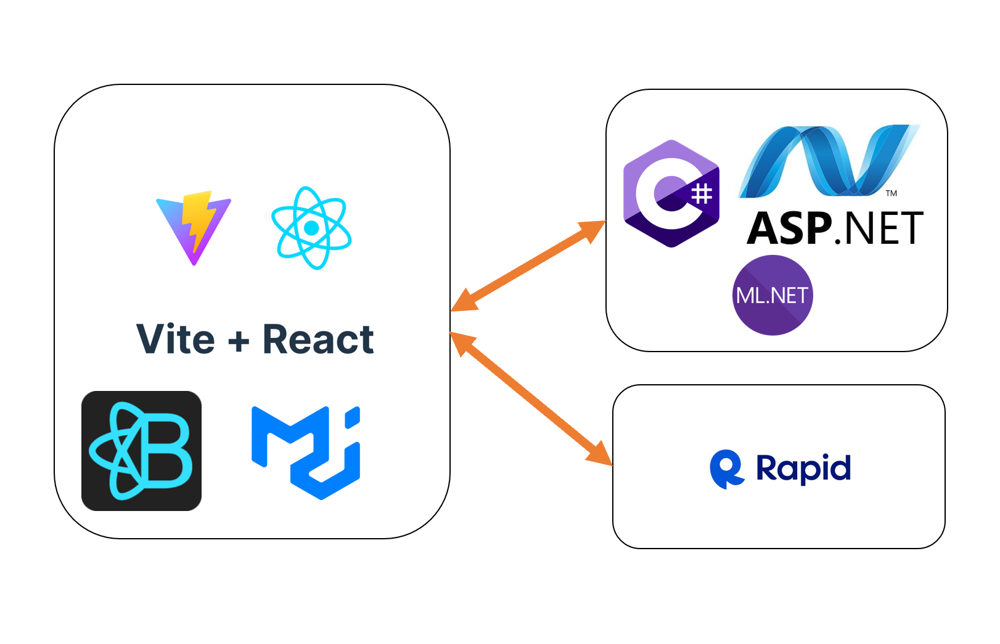

# HackTheChange2023-4thFloor

## Inspiration
"How can we leverage technology towards a sustainable lifestyle". 
Food availability, health and wellness, and environmental impact are all important aspects of sustainability toward a better lifestyle. Carbon emissions have exponentially increased over the years leading to catastrophic environmental impact for millions of people worldwide. Simple fixes oftentimes have the best impact, and with our innovative solution, people can help bring about that change. We have created an application that allows users to upload an image of the food that they eat or purchase, which will then predict the food and its category with our ML model to finally calculate vital statistics about the food such as carbon emission and rating quality. Then it will provide alternative food choices in the same category that has a lower carbon emission footprint.


## How to run

```js
cd frontend
npm install 
npm run dev
```


## Stack

Our tech stack comprises of a frontend created in React using Vite, alongside React bootstrap and MUI for styling. For our backend, we decided to use ASP.Net with C# to connect the backend to the frontend application. Our ML model was trained using ML.Net on image classification of over 23,873 images trained.


